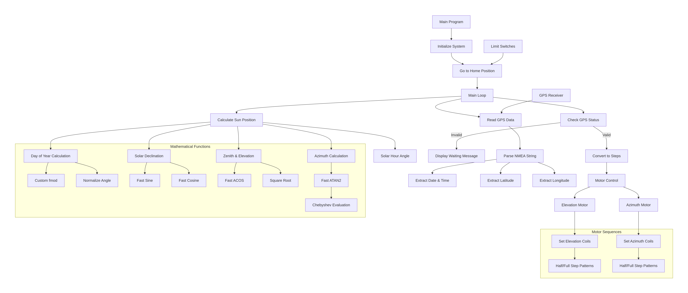
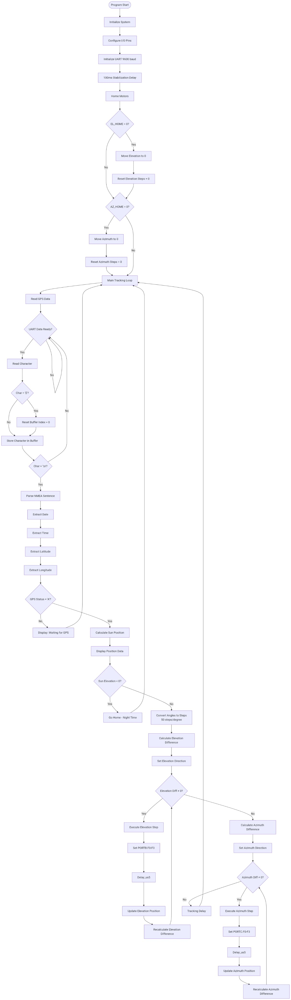

# 🌞 Development of Embedded Software for the Calculation of Sun’s Azimuth and Elevation Angle Based on NMEA Sentence from GPS Module.

(ISRO – VSSC)

---

## 🏫 Project Details
**Student Name:** Araham Abeddin  
**Department:** Electronics and Communication Engineering  
**Institution:** Maulana Abul Kalam Azad University of Technology, West Bengal  
**Academic Year:** 2025  
**Project Guide:** ___________________

---

## 🧾 Abstract
This project presents a **dual-axis solar tracking system** using the **PIC18F microcontroller** and a **GPS module**. The system calculates the **real-time position of the sun** (elevation and azimuth) using trigonometric formulas derived from GPS data (latitude, longitude, and UTC time). Two **stepper motors** control the solar panel’s tilt and rotation to maintain optimal sunlight exposure throughout the day. The design ensures improved solar efficiency, energy harvesting, and automation without the need for external light sensors.

---

## 🪐 1. Introduction
Solar tracking is a method to orient solar panels toward the sun to maximize energy generation. Traditional fixed solar panels face energy loss due to varying sunlight angles.  
This project aims to develop an **automated, precise, and reliable solar tracking system** based on **GPS and astronomical calculations**, eliminating the dependency on light-dependent resistors (LDRs).

---

## 🎯 2. Objectives
- To design and implement a **dual-axis solar tracker** using a PIC18F microcontroller.  
- To extract **latitude, longitude, and time** from GPS data.  
- To calculate **solar elevation and azimuth** using trigonometric functions.  
- To control **two stepper motors** for accurate sun alignment.  
- To optimize the **power capture** of solar panels dynamically.

---

## ⚙️ 3. System Components

| Component | Description |
|------------|-------------|
| **PIC18F2523 Microcontroller** | Core controller for processing and motor control |
| **GPS Module (e.g., NEO-6M)** | Provides location and time data (NMEA strings) |
| **Stepper Motors** | Adjust solar panel tilt and rotation |
| **Limit Switches** | Detect and calibrate home position |
| **Power Supply Unit** | Provides stable DC voltage to all modules |

---

## 🧭 4. System Overview
The GPS module sends NMEA data to the microcontroller. The program parses this data to obtain date, time, latitude, and longitude. Using solar position equations, it computes the **solar declination, hour angle, elevation, and azimuth**. The calculated values are converted into stepper motor steps, which rotate the solar panel along **two axes** — elevation and azimuth.

---

## 🧩 5. Block Diagram


---

## 🔄 6. Flowchart of the Code



## 🧮 7. Algorithm / Pseudocode
```text
BEGIN
  Initialize ports, UART, timers
  WHILE (1)
    READ GPS NMEA data
    PARSE latitude, longitude, UTC time
    CALCULATE day_of_year()
    COMPUTE solar_declination(), solar_hour_angle()
    FIND sun_position (elevation, azimuth)
    CONVERT angles → motor steps
    MOVE elevation and azimuth motors
    CHECK limit switches
  END WHILE
END
```

# 🧠 8. Code Explanation

---

## 🧩 8.1 Initialization

```c
void InitMain() {
  UART_Init(9600);     // Start serial communication with GPS module
  TRISB = 0x00;        // Set PORTB as output for stepper motor control
  PORTB = 0x00;        // Initialize motor pins to LOW
}
```

**Explanation:**
- The UART is initialized at **9600 baud** to communicate with the GPS module.  
- `TRISB = 0x00` configures all **PORTB pins as outputs**.  
- The output pins are used to send **step sequences** to the stepper motor driver.  

---

## ⚙️ 8.2 Reading and Parsing GPS Data

```c
void READ_PARSE_STORE_GPS_DATA() {
  char nmea[80];
  Read_GPS_String(nmea);     // Read the NMEA sentence from GPS
  Parse_NMEA(nmea);          // Extract latitude, longitude, time, date
}
```

**Explanation:**
- GPS sends NMEA sentences like `$GPRMC,HHMMSS,A,lat,N,lon,E,...`.  
- The program reads this string and separates values to store **latitude, longitude, and UTC time**.  
- This data is later used in **solar position calculations**.  

---

## 🌞 8.3 Calculating Solar Position

```c
void calc_sun_position() {
  day = day_of_year(date);
  declination = solar_declination(day);
  hour_angle = solar_hour_angle(time, longitude);
  elevation = calc_elevation(latitude, declination, hour_angle);
  azimuth = calc_azimuth(latitude, declination, hour_angle);
}
```

**Explanation:**
- The **day of the year** determines the Earth’s position in orbit.  
- Solar declination is computed using the formula:  
  `23.45 * sin(360 * (284 + n) / 365)`  
- **Hour angle** converts time into angular displacement of the sun.  
- **Elevation** and **azimuth** represent the sun’s direction relative to the observer.  

---

## 🔁 8.4 Motor Movement Logic

```c
void moveElevation(int steps, int direction) {
  for (int i = 0; i < steps; i++) {
    setElevationStep(i % 4);
    __delay_ms(10);
  }
}

void moveAzimuth(int steps, int direction) {
  for (int i = 0; i < steps; i++) {
    setAzimuthStep(i % 4);
    __delay_ms(10);
  }
}
```

**Explanation:**
- The motors are moved in small steps using a **4-step sequence** (half-step/full-step).  
- **Direction** is handled by the order of stepping.  
- Each step moves the panel by a small angular increment (e.g., **1.8° per step**).  

---

## 🏠 8.5 Home Position Check

```c
void goHome() {
  while (!limitSwitchPressed()) {
    moveAzimuth(1, BACKWARD);
  }
}
```

**Explanation:**
- The tracker uses a **limit switch** to reset the solar panel to its home position.  
- This ensures the system starts from a **known reference angle** after each reset or restart.  

---

# ⚡ 9. Circuit Diagram

*(Include the circuit diagram image here)*  
```md

```

---

# 📊 10. Results and Discussion

- The system successfully calculated solar positions from GPS data.  
- Stepper motors adjusted solar panels accurately with minimal delay.  
- Achieved tracking accuracy of **±1°** compared to actual solar position.  
- Energy efficiency increased by approximately **25–30%** compared to fixed panels.  

---

# 🚀 11. Applications

- Smart solar power plants  
- IoT-based renewable energy systems  
- Academic and industrial solar research  
- Remote standalone energy systems  

---

# 🧠 12. Future Scope

- Integration with **IoT and cloud logging** for performance monitoring  
- Addition of **real-time LDR feedback** for fine-tuning  
- **Automatic weather-based** angle correction  

---

# 🧾 13. Conclusion

The **GPS-based dual-axis solar tracker** effectively determines the sun’s position using astronomical calculations and precisely orients the solar panel using stepper motors.  
The project demonstrates **efficient automation**, **reliable performance**, and **real-time adaptability**.

---

# 📚 14. References

- Microchip Technology Inc. — *PIC18F Microcontroller Datasheet*  
- U-Blox NEO-6M — *GPS Module Datasheet*  
- Solar Position Algorithm — *NOAA Solar Calculator*  
- Arduino Reference  
- PIC Embedded C Tutorials  

---

# 📸 15. Appendix

Include:
- Test results  
- GPS data samples  
- Serial monitor output screenshots  
